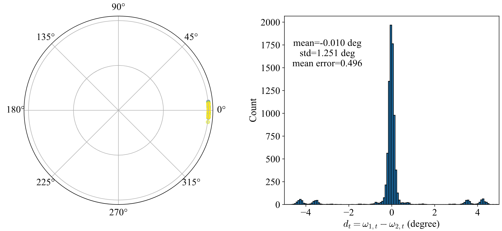
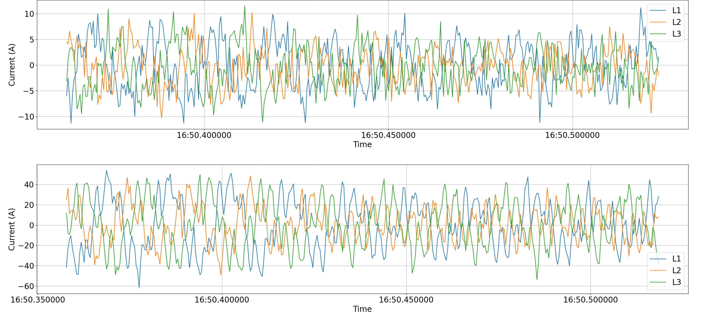

# A Real-World Dataset
The dataset contains data collected from microgrids/distribution systems in California. The data has been anonymized to remove all geographical identifiers. Our [conference poster](assets/Poster.pdf) is available. Our paper will be available on arXiv soon.

## Sample dataset
Download sample dataset from [here](https://caltech.box.com/s/5baxy2ogbalqohpidh1lyxgnnxmv5tuc) and place into sample_dataset folder. 
Here, the data contains the same *types* of data in the complete dataset, but covering a very small time range of all availble data. This allows you to experiment with this dataset without dealing with the colossal full dataset (>10TB and growing). 

## Full dataset
To access the full dataset, please submit a ticket [here](https://forms.office.com/r/Ds6rKEtyTV). We are finalizing the data server for the full dataset. Access will be available in Febuary 2025. Meanwhile, we recommend using the sample dataset here to build your code. The full dataset will be in the same data format.

## Data types

In the following, we explain the 3 types of time-series data as well as circuit topology data in `sample_data`:

### Magnitude
`sample_data/magnitude` includes the root mean squared current and voltage magnitudes. These data do not contain phase angle information. The data is available at 1-second intervals.

### Synchro-phasor
`sample_data/phasor` includes synchro-phasor measurements, which are presented as complex numbers. The data is available at 10-second intervals.

### Synchro-waveform
`sample_data/waveform` includes the raw point-on-wave measurements sampled at 2.5kHz. Each waveform is roughly 1-second in length. One waveform is available every 10 seconds. The capture start times may differ by around 0.01 to 0.1 seconds. The sampling intervals are approximately 400 $\pm$ 4 microseconds.

Notice that the 3 types of data above are increasing in granularity. That is, given waveforms, one can compute phasors using Fast Fourier Transform (FFT). Given phasors, one can compute the magnitudes by taking the magnitude of the complex phasor values.

### Network and parameter
We also provide the time-varying circuit topolgy and parameters, which contain information such as line connectivity, transformer nameplate ratings, and circuit braker status. Importantly, the timeseries measurement metadata is also stored here.

We provide the most granular data which models the circuit down to individual components. Power transfer elements (e.g. lines, transformers, switches) are edges of the graph, whereas buses are nodes. This is called the **physical asset network**. The **electrical network** can be derived by zero- and infinite-impedance elements (e.g. short lines, closed/open breakers). Then nodes connected by zero-impedance elements are combined into a single node. 

The system model varies depending on your application. Examples include bus injection and branch flow models in the phasor domain, dynamic circuit model in the time domain, and transfer matrix models in the Laplace or z domains. See paper Section V for more detailed discussion.

## Quickstart & code examples
### Loading data
See example code in `data_IO.ipynb`.

### State estimation (synchro-phasor)

### Voltage control
Linear DistFLow (LinDistFlow) model with measured slackbus voltage, real and reactive power injections.

### State estimation (synchro-waveform)
Given point on wave measurements and circuit parameters, we can simulate the time-domain circuit power flow. The formulation is described in paper Sections V (b) and VI (b). See example implementation in `code_examples/state_estimation_waveform.ipynb`.

If you think another example may be helpful here, [contact us](#contacts) and consider contributing to this project.


## Data quality
As with any real-world dataset, inaccuracies, gaps, and unknown grid information are present in this dataset. We made a substatial effort to provide the highest quality data possible given practical constraints. Here, we make transparent where information may be inaccurate.

### Synchronization accuracy
From in-the-field testing, our meters show end-to-end synchronization error variance of 0.625 degrees. See paper section IV for a detailed discussion. The synchronization result is shown here. The phase angle is the difference between voltage phase angles of two meters measuring the same node.
<p align="center">
  
</p>

### Sensor error
Sensor error from meters as well as current and potential transformers are generally bounded by 0.5% (and typically even smaller in practice). One exception is where we have oversized current transformers in lightly loaded circuits. The large conductors require large current transformers (CTs) to fit around it. Large CTs generally have a higher current rating. In our deployment, channels `S1`, `S2`, `S3` in `egauge_18`, `egauge_20` are the only instances of this issue.

<p align="center">
  
</p>

### Gaps
Occasional gaps in data are present due to network and power outages, system maintenance. See section [Quickstart](#quickstart) for example code on handling data gaps.

### Circuit topology and parameter 
In practice, it is rare that distribution system operators maintain an error-free record of the system. 
- Lines: For distribution lines, the conductor thickness and material are obtained from engineering drawings and are generally correct, but the insulation material and thickness are estimated from popular cable types given the voltage level. Line lengths are estimated as the Manhattan (taxicab) distance between the two terminals. The lengths of short lines (within the same building structure) are assumed to be zero. Lines are generally underground, un-transposed with unknown cable arrangement (e.g. on a cable tray).
- Transformers: For transformers, the nameplate ratings are generally accurate. The true transformer tap positions are unknown, although off-nominal tap positions are rare. 
- Switches: The default status of `OpenClose` elements including switches, breakers, fuses, relays, etc. are documented in `.json` files. The switching activities during a power outage are obtained from system operators after the event and verified based on state estimation results to ensure accuracy.
- Grounding: Earth ground information are generally accurate, and grounding typically occurs on the secondary side of Delta-Wye transformers.
- Phase labels: In metered elements, `L1`, `L2`, `L3`, refer to phase voltages, `CT1`, `CT2`, `CT3` refer to current transformers, `S1`, `S2`, `S3` refer to meter current measurement channels. In general the numbers 1, 2, 3 correspond to phases A, B and C. Several exceptions are in `egauge_13`, `egauge_14`, `egauge_15`, `egauge_20`. When matching phases to measurements, use the information in `sample_dataset/topology/network_files/<path_to_file>.json` and `EgaugeMeter->registers->element`.

## Citation
todo  
IEEE:
```
```
BibTex:
```
```

## Contacts
We welcome your comments and suggestions at `digitaltwin@caltech.edu`. For discussions and improvements specific to code and data release, you may also use [GitHub Issues](https://github.com/caltech-netlab/digital-twin-dataset/issues) or [Pull requests](https://github.com/caltech-netlab/digital-twin-dataset/pulls).

## Disclaimer
The accuracy or reliability of the data is not guaranteed or warranted in any way and the providers disclaim liability of any kind whatsoever, including, without limitation, liability for quality, performance, merchantability and fitness for a particular purpose arising out of the use, or inability to use the data.

This software is provided by the copyright holders and contributors "as is" and any express or implied warranties, including, but not limited to, the implied warranties of merchantability and fitness for a particular purpose are disclaimed. In no event shall the copyright owner or contributors be liable for any direct, indirect, incidental, special, exemplary, or consequential damages (including, but not limited to, procurement of substitute goods or services; loss of use, data, or profits; or business interruption) however caused and on any theory of liability, whether in contract, strict liability, or tort (including negligence or otherwise) arising in any way out of the use of this software, even if advised of the possibility of such damage.
